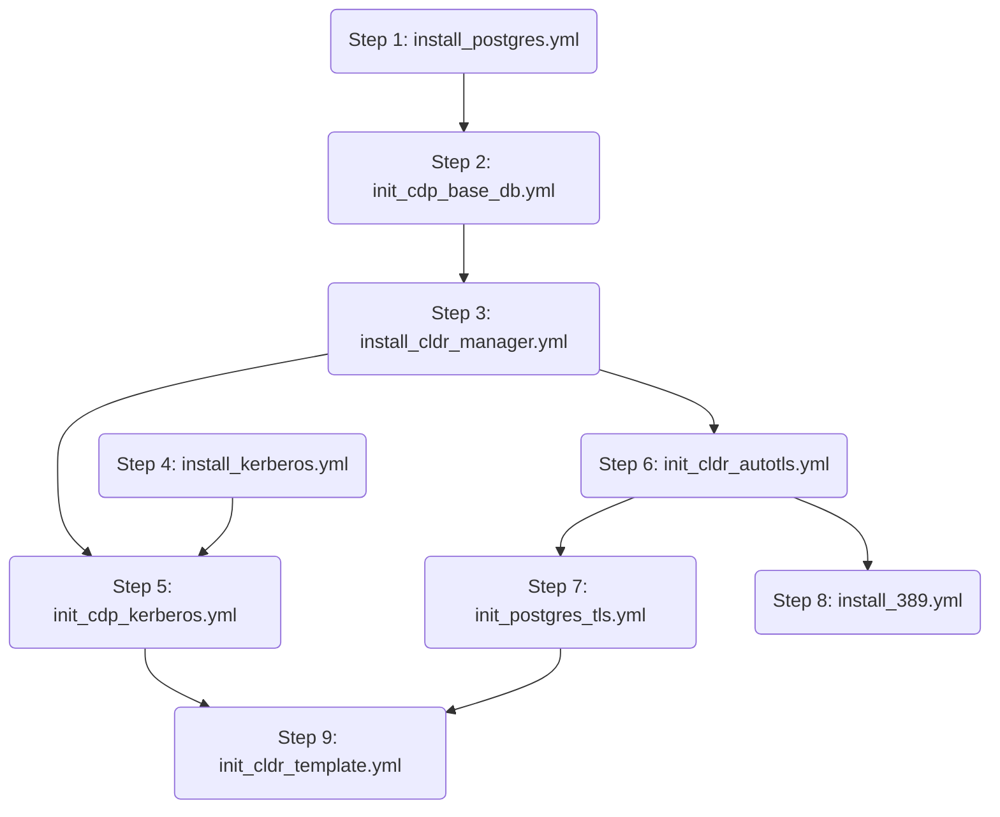

# Task Dependency

```mermaid
  graph TD
    kerberos(Step 4: install_kerberos.yml) --> base_kerberos(Step 5: init_cdp_kerberos.yml)
    postgres(Step 1: install_postgres.yml) --> base_db(Step 2: init_cdp_base_db.yml) 
    base_db --> install_cldr(Step 3: install_cldr_manager.yml)
    install_cldr --> init_cldr_autotls(Step 6: init_cldr_autotls.yml)
    init_cldr_autotls --> init_postgres_tls(Step 7: init_postgres_tls.yml)
    install_cldr --> base_kerberos
    init_postgres_tls --> init_cldr_template(Step 9: init_cldr_template.yml)
    base_kerberos --> init_cldr_template
    init_cldr_autotls --> install_389(Step 8: install_389.yml)
```
See https://github.com/risyomei/cdp-base-helper for Pictures
